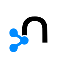
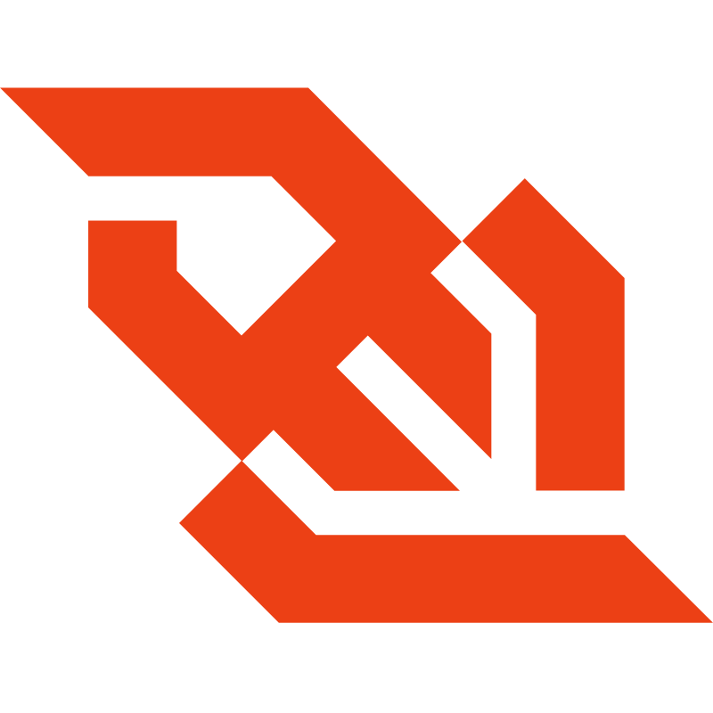

# i9rfs (API Server)

A Remote File System API Server

## Intro

i9rfs is a full-fledged remote file system API server built in Node.js and Neo4j. It supports major remote file system application features, serving as a foundation for building apps like Google Drive and Dropbox clones.

## Technologies & Tools

### Technologies
- **JavaScript/TypeScript/Node.js** - Programming Language/Runtimg
- **Express.js** - REST API Framework
- **Neo4j** - Graph DBMS
- **CypherQL** - Query Language for a Graph database
- **WebSocket** - Full-duplex, Bi-directional communications protocol
- **Google Cloud Storage**

### Tools
- Docker
- Ubuntu Linux
- VSCode
- Git & GitHub Version Control
- GitHub Actions CI

## Table of Contents

- [Intro](#intro)
- [Technologies & Tools](#technologies--tools)
- [Table of Contents](#table-of-contents)
- [Features](#features)
- [✨Technical Highlights✨](#technical-highlights)
- [API Graph Model Overview](#api-graph-model-overview)
- [API Documentation](#api-documentation)
- [API Diagrams](#api-diagrams)

## Features

The following are the features supported by this API. *Visit the API documentation for implementation guides.*

- **Create** directories
- **Upload** and **Download** files
- **List** the contents of a directory
- **Copy** and **Move** files/directories
- **Delete** files/directories
- **Rename** files/directories
- **Move** files/directories **to Trash**
- **View** files/directories **in Trash**
- **Restore** files/directories **from Trash**

## ✨Technical Highlights✨

- A graph data structure perfectly models a file system tree data structure; enough reason to choose a graph database over a relational database that’s not built for graph-like data structures and queries. I tried it, it was hell-y. This project introduced me to the world of graph databases.

- I utilize Neo4j’s variable expression matching extensively to confine object find tree traversal to the user’s root, and to process complex commands such as directory copy and delete which act recursively on sub-directories.

## API Documentation &#x1f4d6;

HTTP API (REST): [Here](./docs/swagger.json). Open in [Swagger Editor](editor.swagger.io)

WebSockets API: [Here](./docs/asyncapi.json) Open in [AsyncAPI Editor](studio.asyncapi.com).

API Graph Model Overview [Here](./docs/graph-model-overview.md)

## API Diagrams &#x1f3a8;

### Architecture Diagram
API (C4) Component Level Diagram: [Here](./arch.pu). (Open in [PlantUML Editor](editor.platuml.com))

### Sequence Diagrams

API sequence diagrams: [Here](./diagrams/sequence-diagrams.md)

## Articles &#x1f4f0;
*Coming Soon...*
